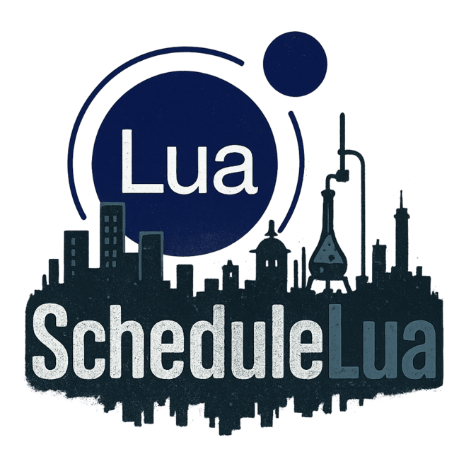

# ScheduleLua



[](https://github.com/ifBars/ScheduleLua/releases)
[](LICENSE)
[]()
[](https://melonwiki.xyz/)
[](https://www.lua.org/)
[](https://docs.microsoft.com/en-us/dotnet/csharp/)
[]()

A Lua modding framework for Schedule I that aims to expose the game's functionality to Lua scripts, enabling custom gameplay mechanics, automation, and new features. ScheduleLua is currently in beta development, and the only features that are known to be working properly are the ones in the example scripts. I and or other contributors cannot guarantee that everything will work or be available, especially after the game updates.

## Table of Contents

- [ScheduleLua](#schedulelua)
  - [Table of Contents](#table-of-contents)
  - [Overview](#overview)
  - [Features](#features)
  - [Installation](#installation)
  - [Getting Started](#getting-started)
    - [Creating Your First Script](#creating-your-first-script)
    - [Script Lifecycle](#script-lifecycle)
  - [Configuration](#configuration)
  - [API Reference](#api-reference)
    - [Logging Functions](#logging-functions)
    - [Console Command Functions](#console-command-functions)
    - [GameObject Functions](#gameobject-functions)
    - [Player Functions](#player-functions)
    - [Inventory Functions](#inventory-functions)
    - [Time Functions](#time-functions)
    - [NPC Functions](#npc-functions)
    - [Map Functions](#map-functions)
    - [Helper Functions](#helper-functions)
  - [API Implementation Checklist](#api-implementation-checklist)
    - [Player System](#player-system)
      - [Basic Player Information](#basic-player-information)
      - [Player Stats](#player-stats)
      - [Player Movement](#player-movement)
    - [NPC System](#npc-system)
      - [Basic NPC Information](#basic-npc-information)
      - [NPC Management](#npc-management)
    - [Inventory System](#inventory-system)
      - [Basic Inventory](#basic-inventory)
      - [Advanced Inventory](#advanced-inventory)
    - [Time System](#time-system)
      - [Basic Time](#basic-time)
      - [Time Events](#time-events)
    - [Map/World System](#mapworld-system)
      - [Regions](#regions)
      - [World Interaction](#world-interaction)
    - [UI System](#ui-system)
      - [Basic UI](#basic-ui)
      - [Advanced UI](#advanced-ui)
    - [Quest System](#quest-system)
      - [Basic Quests](#basic-quests)
      - [Advanced Quests](#advanced-quests)
    - [Economy System](#economy-system)
      - [Basic Economy](#basic-economy)
      - [Advanced Economy](#advanced-economy)
    - [Weather System](#weather-system)
      - [Basic Weather](#basic-weather)
      - [Advanced Weather](#advanced-weather)
    - [Modding Tools](#modding-tools)
      - [Development Tools](#development-tools)
      - [Configuration](#configuration-1)
    - [Event System](#event-system)
      - [Basic Events](#basic-events)
      - [Advanced Events](#advanced-events)
    - [Utility Functions](#utility-functions)
      - [Basic Utilities](#basic-utilities)
      - [Advanced Utilities](#advanced-utilities)
  - [Events](#events)
  - [Console Command System](#console-command-system)
    - [Basic Usage](#basic-usage)
    - [Command Arguments](#command-arguments)
    - [Cleanup](#cleanup)
    - [Example Commands](#example-commands)
    - [Command Best Practices](#command-best-practices)
  - [Example Script](#example-script)
  - [Contributing](#contributing)
    - [Getting Started](#getting-started-1)
    - [Making Changes](#making-changes)
    - [Submitting Your Contribution](#submitting-your-contribution)
    - [Contribution Guidelines](#contribution-guidelines)
  - [License](#license)
  - [Acknowledgments](#acknowledgments)

## Overview

ScheduleLua is a MelonLoader mod that integrates the MoonSharp Lua interpreter with Schedule I, providing an easy to learn, flexible scripting environment. The framework exposes core game systems through a Lua API, allowing modders to create custom gameplay experiences without direct C# coding.

## Features

- **Robust Lua Environment**: Built on MoonSharp for .NET integration
- **Hot Reloading**: Edit scripts while the game is running for rapid development
- **Event System**: Subscribe to game events like day changes, player status updates, etc.
- **ScheduleOne API**: Access to player, NPCs, and more
- **Error Handling**: Detailed error reporting and script isolation
- **Mod Configuration**: Configurable settings via MelonPreferences

## Installation

[](https://melonwiki.xyz/#/?id=automated-installation)
[](https://store.steampowered.com/)
[](https://thunderstore.io/)

1. Install [MelonLoader](https://melonwiki.xyz/#/?id=automated-installation) for Schedule I
2. Download the latest ScheduleLua release zip from [Thunderstore](https://thunderstore.io/)
3. Extract the zip file and drag the `Mods` and `UserLibs` folders into your Schedule I game directory
4. Launch the game

## Getting Started

For a comprehensive guide on getting started with ScheduleLua, visit our [online documentation](https://ifbars.github.io/ScheduleLua-Docs/guide/getting-started.html).

### Creating Your First Script

Create a new `.lua` file in the `Mods/ScheduleLua/Scripts` directory. Check `Resources` directory in the repo for example lua scripts.

### Script Lifecycle

1. **Loading**: Scripts are loaded when the game starts or when modified (hot reload)
2. **Initialization**: The `Initialize()` function is called if it exists
3. **Update**: The `Update()` function is called every frame if it exists
4. **Events**: Event handlers are called when the corresponding game events occur

## Configuration

Edit settings in `UserData/MelonPreferences.cfg`:

```
[ScheduleLua]
EnableHotReload = true
LogScriptErrors = true
```

## API Reference

### Logging Functions

| Function              | Description                           |
| --------------------- | ------------------------------------- |
| `Log(message)`        | Logs a normal message to the console  |
| `LogWarning(message)` | Logs a warning message to the console |
| `LogError(message)`   | Logs an error message to the console  |

### Console Command Functions

| Function                                              | Description                                       |
| ----------------------------------------------------- | ------------------------------------------------- |
| `RegisterCommand(name, description, usage, callback)` | Registers a console command with the game         |
| `UnregisterCommand(name)`                             | Unregisters a previously registered command       |
| `UnregisterAllCommands()`                             | Unregisters all commands registered by the script |
| `IsCommandRegistered(name)`                           | Checks if a command is registered                 |

### GameObject Functions

| Function                           | Description                       |
| ---------------------------------- | --------------------------------- |
| `FindGameObject(name)`             | Finds a GameObject by name        |
| `GetPosition(gameObject)`          | Gets the position of a GameObject |
| `SetPosition(gameObject, x, y, z)` | Sets the position of a GameObject |

### Player Functions

| Function                       | Description                                                                                  |
| ------------------------------ | -------------------------------------------------------------------------------------------- |
| `GetPlayer()`                  | Gets the local player object                                                                 |
| `GetPlayerState()`             | Gets a table containing player status, health, energy, position, and other state information |
| `GetPlayerPosition()`          | Gets the position of the player as a Vector3 or table with x, y, z coordinates               |
| `SetPlayerPosition(x, y, z)`   | Sets the position of the player                                                              |
| `TeleportPlayer(x, y, z)`      | Teleports the player to the specified coordinates                                            |
| `GetPlayerMoney()`             | Gets the player's current money                                                              |
| `AddPlayerMoney(amount)`       | Adds money to the player                                                                     |
| `GetPlayerEnergy()`            | Gets the player's current energy                                                             |
| `SetPlayerEnergy(amount)`      | Sets the player's energy                                                                     |
| `GetPlayerHealth()`            | Gets the player's current health                                                             |
| `SetPlayerHealth(amount)`      | Sets the player's health                                                                     |
| `GetPlayerRegion()`            | Gets the name of the region the player is currently in                                       |
| `IsPlayerInRegion(regionName)` | Checks if the player is in the specified region                                              |
| `GetPlayerMovementSpeed()`     | Gets the player's current movement speed multiplier                                          |
| `SetPlayerMovementSpeed(speed)`| Sets the player's movement speed multiplier (1.0 is normal speed)                            |

### Inventory Functions

| Function                                    | Description                                 |
| ------------------------------------------- | ------------------------------------------- |
| `GetInventorySlotCount()`                   | Gets the number of inventory slots          |
| `GetInventoryItemAt(slotIndex)`             | Gets the item name at the specified slot    |
| `AddItemToInventory(itemName, amount)`      | Adds an item to the player's inventory      |
| `RemoveItemFromInventory(itemName, amount)` | Removes an item from the player's inventory |

### Time Functions

| Function                    | Description                        |
| --------------------------- | ---------------------------------- |
| `GetGameTime()`             | Gets the current game time         |
| `GetGameDay()`              | Gets the current day as a string   |
| `GetGameDayInt()`           | Gets the current day as an integer |
| `IsNightTime()`             | Returns true if it's night time    |
| `FormatGameTime(timeValue)` | Formats a time value as a string   |

### NPC Functions

| Function                       | Description                                           |
| ------------------------------ | ----------------------------------------------------- |
| `FindNPC(npcName)`             | Finds an NPC by name                                  |
| `GetNPC(npcId)`                | Gets detailed information about an NPC by ID          |
| `GetNPCPosition(npc)`          | Gets the position of an NPC                           |
| `SetNPCPosition(npc, x, y, z)` | Sets the position of an NPC                           |
| `GetNPCRegion(npcId)`          | Gets the current region of an NPC                     |
| `GetNPCsInRegion(region)`      | Gets all NPCs in a specific region                    |
| `GetAllNPCs()`                 | Gets information about all NPCs in the game           |
| `GetAllNPCRegions()`           | Gets a list of all regions that NPCs are currently in |
| `IsNPCInRegion(npcId, region)` | Checks if an NPC is currently in a specific region    |

### Map Functions

| Function             | Description                              |
| -------------------- | ---------------------------------------- |
| `GetAllMapRegions()` | Gets a list of all available map regions |

### Helper Functions

| Function                  | Description                                  |
| ------------------------- | -------------------------------------------- |
| `Vector3(x, y, z)`        | Creates a new Vector3                        |
| `Vector3Distance(v1, v2)` | Calculates the distance between two Vector3s |

## API Implementation Checklist

This checklist tracks the current state of the ScheduleLua API implementation. Use this to understand what features are available and what's planned for future updates. This checklist is subject to changes and there will be more things added once more bindings get finished.

### Player System

#### Basic Player Information
- [x] Get player state (health, energy, position, etc.)
- [x] Get player position
- [x] Get player region
- [x] Check if player is in specific region
- [x] Get player name
- [x] Get player movement state (sprinting, crouching, etc.)

#### Player Stats
- [x] Get/set player health
- [x] Get/set player energy
- [x] Get/set player money
- [x] Monitor health changes
- [x] Monitor energy changes
- [x] Monitor money changes

#### Player Movement
- [x] Teleport player
- [x] Set player position
- [x] Get player movement speed
- [x] Check if player is grounded
- [ ] Force player movement
- [x] Set player movement speed
- [ ] Apply forces to player

### NPC System

#### Basic NPC Information
- [x] Find NPC by ID
- [x] Get NPC position
- [x] Get NPC region
- [x] Get NPC name
- [x] Get NPC state (conscious, moving, etc.)
- [ ] Get NPC schedule
- [ ] Get NPC relationships

#### NPC Management
- [x] Get all NPCs in region
- [x] Get all NPCs in game
- [x] Check if NPC is in region
- [ ] Spawn NPC
- [ ] Remove NPC
- [ ] Modify NPC behavior
- [ ] Set NPC schedule

### Inventory System

#### Basic Inventory
- [ ] Get inventory slot count
- [ ] Get item at slot
- [ ] Add item to inventory
- [ ] Remove item from inventory
- [ ] Get item properties
- [ ] Use item
- [ ] Drop item
- [ ] Sort inventory

#### Advanced Inventory
- [ ] Get item durability
- [ ] Repair item
- [ ] Combine items
- [ ] Split item stack
- [ ] Get item weight
- [ ] Check inventory weight limit

### Time System

#### Basic Time
- [x] Get current game time
- [x] Get current day
- [x] Check if night time
- [x] Format time values
- [ ] Set game time
- [ ] Set game day
- [ ] Pause time
- [ ] Speed up time

#### Time Events
- [ ] Day change events
- [ ] Time change events
- [ ] Sleep start/end events
- [ ] Weather change events
- [ ] Season change events

### Map/World System

#### Regions
- [x] Get all map regions
- [x] Get player region
- [x] Get NPC region
- [ ] Create custom region
- [ ] Modify region properties
- [ ] Get region weather
- [ ] Get region time

#### World Interaction
- [ ] Spawn objects
- [ ] Remove objects
- [ ] Modify terrain
- [ ] Create buildings
- [ ] Modify environment
- [ ] Create custom locations

### UI System

#### Basic UI
- [ ] Create custom UI elements
- [ ] Show/hide UI elements
- [ ] Modify UI layout
- [ ] Create custom HUD elements
- [ ] Show notifications
- [ ] Create menus

#### Advanced UI
- [ ] Create custom windows
- [ ] Handle UI input
- [ ] Create custom buttons
- [ ] Create custom sliders
- [ ] Create custom text fields
- [ ] Create custom images

### Quest System

#### Basic Quests
- [ ] Create quests
- [ ] Start quests
- [ ] Complete quests
- [ ] Get quest status
- [ ] Get quest objectives
- [ ] Modify quest progress

#### Advanced Quests
- [ ] Create branching quests
- [ ] Create timed quests
- [ ] Create repeatable quests
- [ ] Create quest chains
- [ ] Create quest rewards
- [ ] Create quest conditions

### Economy System

#### Basic Economy
- [x] Get player money
- [x] Add/remove player money
- [x] Get shop inventory
- [x] Buy/sell items
- [x] Get item prices
- [x] Modify item prices
- [x] Get ATM deposit limit
- [x] Set ATM deposit limit

#### Advanced Economy
- [ ] Create shops
- [ ] Modify shop inventory
- [ ] Create trading system
- [ ] Create economy events
- [ ] Create market fluctuations
- [ ] Create custom currencies

### Weather System

#### Basic Weather
- [ ] Get current weather
- [ ] Set weather
- [ ] Get weather forecast
- [ ] Create weather effects
- [ ] Modify weather intensity
- [ ] Create custom weather

#### Advanced Weather
- [ ] Create weather patterns
- [ ] Create weather zones
- [ ] Create weather events
- [ ] Modify weather duration
- [ ] Create weather transitions
- [ ] Create weather effects

### Modding Tools

#### Development Tools
- [x] Hot reloading
- [x] Error logging
- [x] Script isolation
- [ ] Debug console
- [ ] Performance monitoring
- [ ] Script profiling

#### Configuration
- [x] Mod preferences
- [x] Script settings
- [ ] Save/load configuration
- [ ] Create custom settings
- [ ] Modify game settings
- [ ] Create presets

### Event System

#### Basic Events
- [x] Player events
- [x] Time events
- [x] Scene events
- [ ] Command events
- [ ] UI events
- [ ] Inventory events

#### Advanced Events
- [ ] Custom events
- [ ] Event conditions
- [ ] Event chains
- [ ] Event priorities
- [ ] Event cancellation
- [ ] Event scheduling

### Utility Functions

#### Basic Utilities
- [x] Logging
- [x] Vector operations
- [x] Table operations
- [ ] String operations
- [ ] Math operations
- [ ] Time operations

#### Advanced Utilities
- [ ] File operations
- [ ] Network operations
- [ ] Data persistence
- [ ] Random generation
- [ ] Path finding
- [ ] Collision detection

## Events

- `OnSceneLoaded(sceneName)`: Called when a Unity scene is loaded
- `OnPlayerReady()`: Called when the player character is fully initialized
- `OnGameDayChanged(dayName, dayIndex)`: Called when the game day changes
- `OnGameTimeChanged(timeValue)`: Called when the game time changes
- `OnCommand(command)`: Called when a console command is entered (deprecated, use RegisterCommand instead)
- `OnPlayerHealthChanged(oldValue, newValue)`: Called when player health changes
- `OnPlayerEnergyChanged(oldValue, newValue)`: Called when player energy changes
- `OnSleepStart()`: Called when the player goes to sleep
- `OnSleepEnd()`: Called when the player wakes up

## Console Command System

ScheduleLua provides a system for creating custom console commands that integrate with the native ScheduleOne console. This allows mod developers to easily create commands that can be used in the game's built-in console.

### Basic Usage

To register a command, use the `RegisterCommand` function in your script's `Initialize` function:

```lua
function Initialize()
    RegisterCommand(
        "commandname",        -- Name of the command
        "Command description", -- Description shown in help
        "commandname arg1",   -- Example usage
        function(args)        -- Callback function
            -- Command implementation
            Log("Command executed!")
        end
    )
end
```

### Command Arguments

The callback function receives a table containing the command arguments:

```lua
RegisterCommand("greet", "Greets someone", "greet John", function(args)
    local name = args[1] or "stranger"
    Log("Hello, " .. name .. "!")
end)
```

### Cleanup

It's good practice to unregister your commands when your script shuts down:

```lua
function Shutdown()
    UnregisterCommand("commandname")
    -- Or unregister all commands from this script:
    -- UnregisterAllCommands()
end
```

### Example Commands

Here's a more complex example showing how to create useful commands:

```lua
-- Teleport to a specific region
RegisterCommand(
    "tpnpc",
    "Teleports to an npn in the specified region",
    "tpnpc barn",
    function(args)
        if #args < 1 then
            Log("Usage: tpnpc <region_name>")
            return
        end
        
        local regionName = args[1]
        local allRegions = GetAllMapRegions()
        
        -- Check if region exists
        local found = false
        for i = 1, #allRegions do
            if string.lower(allRegions[i]) == string.lower(regionName) then
                regionName = allRegions[i]  -- Use correct case
                found = true
                break
            end
        end
        
        if not found then
            Log("Region not found: " .. regionName)
            return
        end
        
        -- Find NPCs in region to teleport near
        local npcsInRegion = GetNPCsInRegion(regionName)
        if #npcsInRegion > 0 then
            local npc = FindNPC(npcsInRegion[1].id)
            if npc then
                local pos = GetNPCPosition(npc)
                SetPlayerPosition(pos.x + 1, pos.y, pos.z + 1)
                Log("Teleported to " .. regionName)
            else
                Log("Could not find NPC to teleport near")
            end
        else
            Log("No NPCs found in region: " .. regionName)
        end
    end
)
```

### Command Best Practices

- Choose command names that don't conflict with built-in commands
- Provide clear descriptions and usage examples
- Handle missing or invalid arguments gracefully
- Include proper error handling in your command functions
- Unregister commands when your script is unloaded

## Example Script

```lua
-- ScheduleLua Example Script
-- This script demonstrates the API available for modding ScheduleOne

-- Print a header for our script
Log("Example script loaded!")

-- Track player state
local playerLastPosition = nil
local playerLastRegion = nil
local playerLastMoney = 0
local npcPositions = {}

-- Initialize function called when script is first loaded
function Initialize()
    Log("Example script initialized!")
    
    return true
end

-- Update function called every frame
function Update()
    -- This function is called frequently, so we'll only do occasional checks
    -- In a real mod, you would want to limit how often you perform actions here
    
    -- Check if player has moved significantly (more than 5 units)
    local currentPos = GetPlayerPosition()
    if playerLastPosition then
        -- Use Vector3Distance to compare positions
        local distance = Vector3Distance(currentPos, playerLastPosition)
        if distance > 5 then
            Log("Player moved significantly!")
            Log("Distance moved: " .. distance)
            playerLastPosition = currentPos
            
            -- Create a custom event for movement
            OnPlayerMovedSignificantly()
        end
    end
end

-- Called when the console is fully loaded and ready
function OnConsoleReady()

    -- Register console commands
    RegisterCommand(
        "help",
        "Shows available commands",
        "help",
        function(args)
            Log("Available commands: help, pos, time, heal, energy, region, npcs")
        end
    )
    
    RegisterCommand(
        "pos",
        "Shows player position",
        "pos",
        function(args)
            local pos = GetPlayerPosition()
            Log("Position: " .. pos.x .. ", " .. pos.y .. ", " .. pos.z)
        end
    )
    
    RegisterCommand(
        "time",
        "Shows current game time and day",
        "time",
        function(args)
            Log("Time: " .. FormatGameTime(GetGameTime()) .. ", Day: " .. GetGameDay())
        end
    )
    
    RegisterCommand(
        "heal",
        "Heals player to full health",
        "heal",
        function(args)
            SetPlayerHealth(100)
            Log("Healed player to full health")
        end
    )
    
    RegisterCommand(
        "energy",
        "Restores player energy",
        "energy",
        function(args)
            SetPlayerEnergy(100)
            Log("Restored player energy")
        end
    )
    
    RegisterCommand(
        "region",
        "Shows current region",
        "region",
        function(args)
            Log("Current region: " .. GetPlayerRegion())
        end
    )
    
    RegisterCommand(
        "npcs",
        "Shows the total number of NPCs in the world",
        "npcs",
        function(args)
            local npcs = GetAllNPCs()
            local count = 0
            for _ in pairs(npcs) do count = count + 1 end
            Log("There are " .. count .. " NPCs in the world")
        end
    )
end

-- Called when the player is fully loaded and ready
function OnPlayerReady()
    Log("Player is ready!")
    
    -- Get initial player state
    playerLastPosition = GetPlayerPosition()
    playerLastRegion = GetPlayerRegion()
    playerLastMoney = GetPlayerMoney()
    
    -- Log player information with nil checks
    Log("Player starting in region: " .. (playerLastRegion))
    Log("Player energy: " .. (GetPlayerEnergy()))
    Log("Player health: " .. (GetPlayerHealth()))
    
    -- Log player position (using Vector3Proxy)
    local pos = GetPlayerPosition()
    if pos then
        Log("Player position: " .. pos.x .. ", " .. pos.y .. ", " .. pos.z)
    else
        Log("Player position: Unknown")
    end
    
    -- Get current game time
    local currentTime = GetGameTime()
    local formattedTime = currentTime and FormatGameTime(currentTime)
    Log("Current game time: " .. formattedTime)
    Log("Current day: " .. (GetGameDay()))
    
    -- Get all map regions
    Log("Available map regions:")
    local regions = GetAllMapRegions() or {}
    for i, region in pairs(regions) do
        Log("  - " .. region)
    end
    
    -- Find NPCs in the same region as player
    if playerLastRegion then
        Log("NPCs in player's region:")
        local npcsInRegion = GetNPCsInRegion(playerLastRegion) or {}
        for i, npc in pairs(npcsInRegion) do
            Log("  - " .. npc.fullName)
            -- Store initial NPC positions for tracking
            local npcObj = FindNPC(npc.fullName)
            if npcObj then
                npcPositions[npc.id] = GetNPCPosition(npcObj)
            end
        end
    end
    
    -- Count inventory slots
    local slotCount = GetInventorySlotCount()
    Log("Player has " .. slotCount .. " inventory slots")
    
    -- Check what's in the inventory slots
    for i = 0, slotCount do
        local itemName = GetInventoryItemAt(i)
        if itemName and itemName ~= "" then
            Log("Slot " .. i .. " contains: " .. itemName)
        end
    end
end

function OnSceneLoaded(sceneName)
    Log("Scene loaded: " .. sceneName)
end

-- Called when the game day changes
function OnDayChanged(day)
    Log("Day changed to: " .. day)
    -- You could reset daily tracking variables here
end

-- Called when the game time changes
function OnTimeChanged(time)
    -- Only log time changes occasionally to avoid spam
    if time % 3 == 0 then
        Log("Time is now: " .. FormatGameTime(time))
        
        -- Check if it's night time
        if IsNightTime() then
            Log("It's night time!")
        end
    end
end

-- Called when player health changes
function OnPlayerHealthChanged(newHealth)
    Log("Player health changed to: " .. newHealth)
    -- Provide healing items or special effects at low health
    if newHealth < 30 then
        Log("Player health is low!")
    end
end

-- Called when player energy changes
function OnPlayerEnergyChanged(newEnergy)
    Log("Player energy changed to: " .. newEnergy)
    -- Provide energy items or special effects at low energy
    if newEnergy < 30 then
        Log("Player energy is low!")
    end
end

-- Called when the player enters a new region
function OnPlayerMovedSignificantly()
    local currentRegion = GetPlayerRegion()
    
    -- Add nil checks for both regions
    if currentRegion and playerLastRegion and currentRegion ~= playerLastRegion then
        Log("Player changed region from " .. playerLastRegion .. " to " .. currentRegion)
        playerLastRegion = currentRegion
        
        -- Get NPCs in the new region
        Log("NPCs in new region:")
        local npcsInRegion = GetNPCsInRegion(currentRegion) or {}
        for i, npc in pairs(npcsInRegion) do
            Log("  - " .. npc.fullName)
        end
    elseif currentRegion and not playerLastRegion then
        Log("Player entered region: " .. currentRegion)
        playerLastRegion = currentRegion
    end
end

-- Cleanup function called when script is unloaded
function Shutdown()
    -- Unregister all commands
    UnregisterCommand("help")
    UnregisterCommand("pos")
    UnregisterCommand("time")
    UnregisterCommand("heal")
    UnregisterCommand("energy")
    UnregisterCommand("region")
    UnregisterCommand("npcs")
    
    Log("Example script shutdown, all commands unregistered")
end

-- Return true to indicate successful execution
return true 
```

## Contributing

[](https://github.com/ifBars/ScheduleLua/pulls)
[](https://github.com/ifBars/ScheduleLua/issues)
[](https://github.com/ifBars/ScheduleLua/graphs/contributors)

We welcome contributions to ScheduleLua! This guide will walk you through the process of contributing to the project.

### Getting Started

1. **Fork the Repository**
   - Visit [ScheduleLua GitHub repository](https://github.com/ifBars/ScheduleLua)
   - Click the "Fork" button in the top right corner
   - This creates a copy of the repository in your GitHub account

2. **Clone Your Fork**
   ```bash
   git clone https://github.com/YOUR-USERNAME/ScheduleLua.git
   cd ScheduleLua
   ```

3. **Add the Original Repository as Upstream**
   ```bash
   git remote add upstream https://github.com/ifBars/ScheduleLua.git
   ```

### Making Changes

4. **Create a Feature Branch**
   ```bash
   git checkout -b feature/your-feature-name
   ```
   - Use a descriptive branch name related to your changes
   - Prefix with `feature/`, `bugfix/`, `docs/`, etc. as appropriate

5. **Make Your Changes**
   - Implement your feature or fix
   - Follow the existing code style and conventions
   - Add or update documentation as needed

6. **Test Your Changes**
   - Ensure your changes work as expected
   - Test with the game to verify functionality
   - Check for any unintended side effects

7. **Commit Your Changes**
   ```bash
   git add .
   git commit -m "Add a descriptive commit message"
   ```
   - Use clear and descriptive commit messages
   - Reference issue numbers in commit messages when applicable

### Submitting Your Contribution

8. **Keep Your Branch Updated**
   ```bash
   git fetch upstream
   git rebase upstream/main
   ```

9. **Push to Your Fork**
   ```bash
   git push origin feature/your-feature-name
   ```

10. **Create a Pull Request**
    - Go to your fork on GitHub
    - Click "New Pull Request"
    - Select your feature branch
    - Click "Create Pull Request"
    - Fill in the PR template with details about your changes
    - Reference any related issues

11. **Respond to Feedback**
    - Be responsive to comments and feedback
    - Make requested changes and push to your branch
    - The PR will update automatically

### Contribution Guidelines

- **Code Style**: Follow the existing code style in the project
- **Documentation**: Update documentation when adding or changing features
- **Commits**: Keep commits focused and logically separate
- **Testing**: Test your changes thoroughly before submitting
- **Issues**: Create an issue before working on major changes

Thank you for contributing to ScheduleLua!

## License

[](LICENSE)

This project is licensed under the GPL-3.0 License - see the LICENSE file for details.

## Acknowledgments

- [MelonLoader](https://melonwiki.xyz/#/) for the mod loader
- [MoonSharp](https://www.moonsharp.org/) for the Lua interpreter
- [TVGS](https://scheduleonegame.com/) for making Schedule 1
- All contributors and the modding community